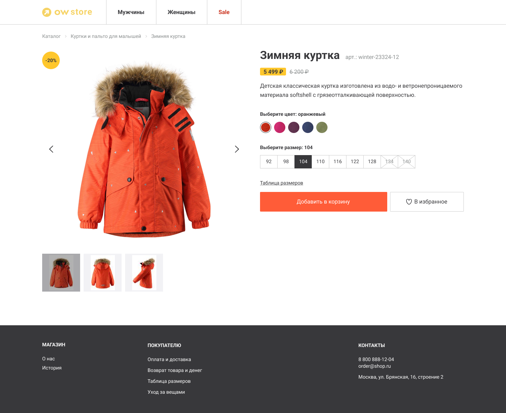

# OW Store

### Description
Product page for the OW Store (online-store)



### Features
- Adaptive layout
- Animation for clickable elements
- Changing images in the slider by clicking on the navigation arrows/thumbnails/swipe
- Change images when choosing a different color
- Choice of color and size of the product
- Sending the product to the cart
- Adding an item to favorites

### Installation
#### Development mode
Open the console
```bash
npm clone https://github.com/vladkrakhmalev/OWStore // Clone the repository
npm install // Install dependencies
npm run dev // Launching in development mode
```
#### Production mode
```bash
npm clone https://github.com/vladkrakhmalev/OWStore // Clone the repository
npm install // Install dependencies
npm run build // Building in production mode
npm run preview // Launching in production mode
```

### Tech Stack 
- Vue
- Swiper